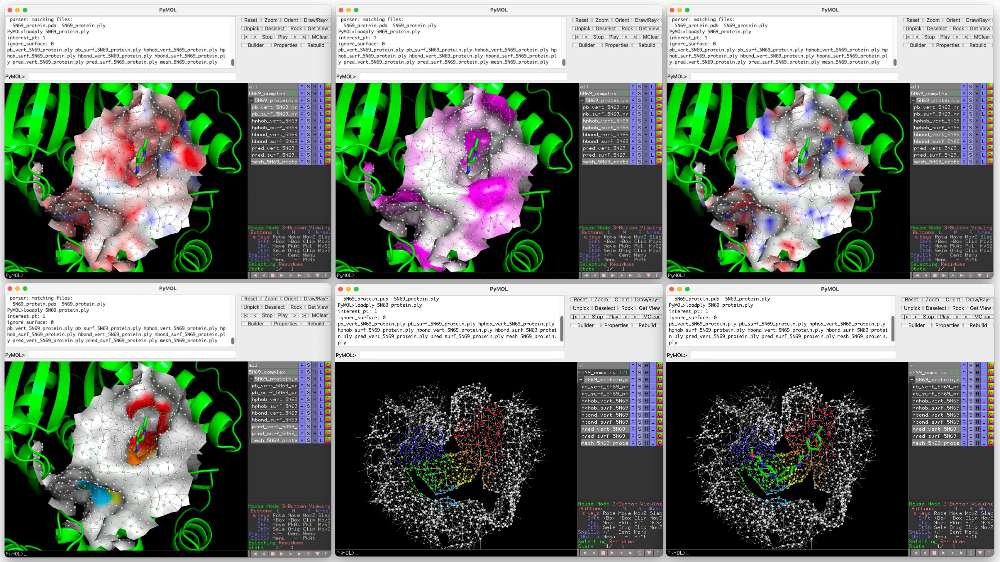

# ProBiSEnSe pymol plugin
**ProBiSEnSe** represents **Pro**tein **Bi**nding **S**ite **En**semble **Se**gmentation.  
Adapted from [MaSIF](https://github.com/LPDI-EPFL/masif/tree/master/source/masif_pymol_plugin), it is a visualization tool for the feature rich surface files using PyMOL.   


***Example data (PDB:5N69) open in Zenodo:*** [](https://doi.org/10.5281/zenodo.14950638)


## Original features in masif_pymol_plugin:
* This is a PyMOL plugin to visualize the feature rich surface files generated by MaSIF. 
* This plugin was used to make all the figures in the MaSIF paper. 
* This code is released under an Apache License v2.0. Feel free to use this code for your own plugins.

## Modified (differed) from the original source
* Adding a function to focus only on the interest pt (required the **interest** column in the .ply file)  
* Adding a function not to show surface to increase the speed to load a file.  
* Visualizing additional features in .ply files: **label**, **pred** (colored with different classes).  
* Adding a function to superimpose the .ply files with pdb alignment.  


## How to use?
### Download
First, download the zip file from GitHub:   
```bash
wget https://github.com/yuyuan871111/ProBiSEnSe_pymol_plugin/releases/download/0.1.1/ProBiSEnSe_pymol_plugin.zip
```
Then, install the plugin using `Plugin Manager` in PyMOL.
1. `Install New Plugin` > `Install from local file` > `Choose file...` > go to the path where you download your zip file (no need to decompress) > `install`   
2. Restart PyMOL and will be available when using console in PyMOL.  


### Load
If you have installed the plugin in your PyMOL, simply type:
```bash
# loadply [.ply file], [interest_pt], [ignore_surface]
loadply sample.ply, 1, 0
```

Alternatively:   
```python
# alternative way in PyMOL console with correct path of the package
from probiosense_pymol_plugin.loadPLY import load_ply
load_ply(filename = "sample.ply", interest_pt = 1, ignore_surface = 0)
```
Note that:
* `filename`: indicate your .ply file
* `insterest_pt`: if you want to draw only the regions of interest, set it `1`. Otherwise, set it `0` for the whole protein. (default: `1`)
* `ignore_surface`: if you want to draw the surface as well, set it `0`. Otherwise, set it `1` to ignore the surface. (default: `0`)

#### Test with example files [](https://doi.org/10.5281/zenodo.14950638)
```bash
# in your pymol console
load 5N69_complex.pdb         # protein + ligand (saved in the pdb file)   
loadply 5N69_protein.ply      # protein surface file using default settings
```

### Superimpose (for PLY)
This superimpose function is to superimpose the PLY file based on the correponding PDB file. This was implemented by superimposing `sample` to `reference` and `sample.ply` will be transformed using the same rotational translational matrix.   
```bash
# superply [pdb_query object name], [ply_query name], [pdb_ref object name]
superply sample, sample.ply, reference
```
* `sample` is a pdb object in pymol.
* `sample.ply` is a `cgo group`, which was loaded using `loadply`. The `sample.ply` **must** be the surface file of the pdb file `sample`.  
*  `reference` is a reference pdb object in pymol to be aligned to.

#### Test with example files [](https://doi.org/10.5281/zenodo.14950638)
```bash
# in your pymol console
load 5N69_complex.pdb         # load the pdb file
loadply 5N69_protein.ply      # load the ply file 

fetch 8QYR                    # fetch a reference PDB file

superply 5N69_complex, 5N69_protein.ply, 8QYR  # superimpose the ply 
```

## Pack the script into a zip file
```bash
zip -r {filename.zip} {foldername}

# e.g.
zip -r ProBiSEnSe_pymol_plugin.zip ProBiSEnSe_pymol_plugin
```
